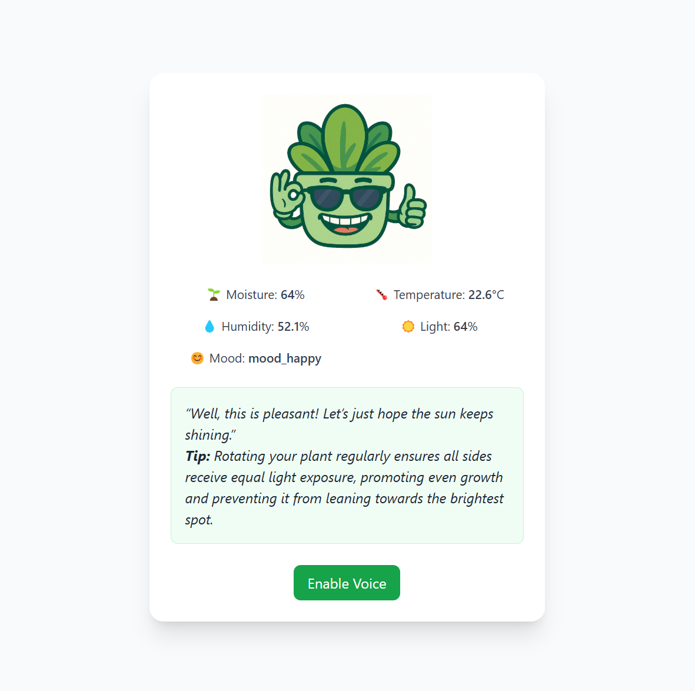

# Plant Tamagotchi 🌱

A playful “Tamagotchi” for your plant—reads real‑time sensor data over serial, determines your plant’s mood, and uses an Ollama AI model to generate friendly care tips. Built with Flask, Tailwind CSS, and the Ollama Python API.

---

## 🚀 Features

- **Real‑time sensor streaming**  
  Reads temperature, humidity, and light from a serial‑connected microcontroller.
- **Mood detection**  
  Classifies plant mood (hot, cold, thirsty, happy, etc.) based on sensor thresholds.
- **AI‑generated feedback**  
  Uses Ollama to craft a playful “plant speaks” line and a short care tip when mood changes.
- **Web UI**  
  Responsive single‑page app built with Tailwind CSS and marked.js for rich text.
- **Voice output**  
  Optional text‑to‑speech of the AI’s message.

---

## 📸 Screenshot

  
*UI updates live with sensor readings, mood icon, message box, and “Enable Voice” button.*
